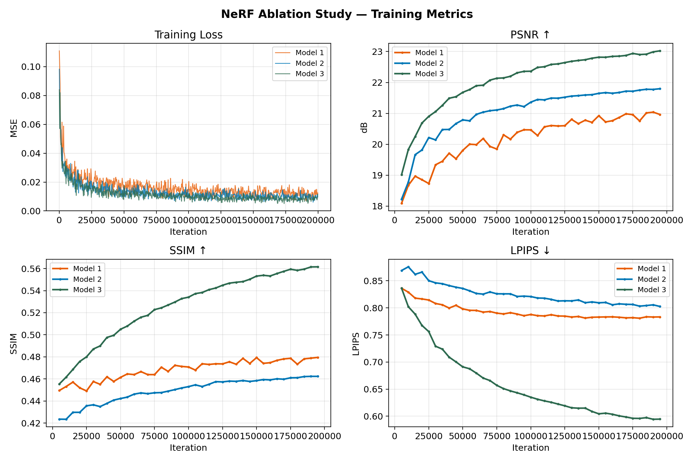
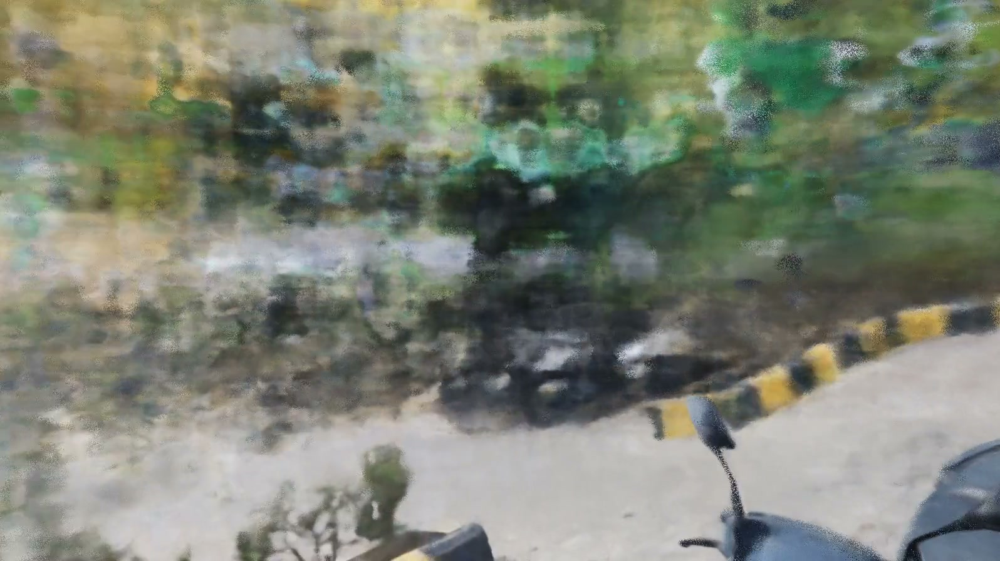
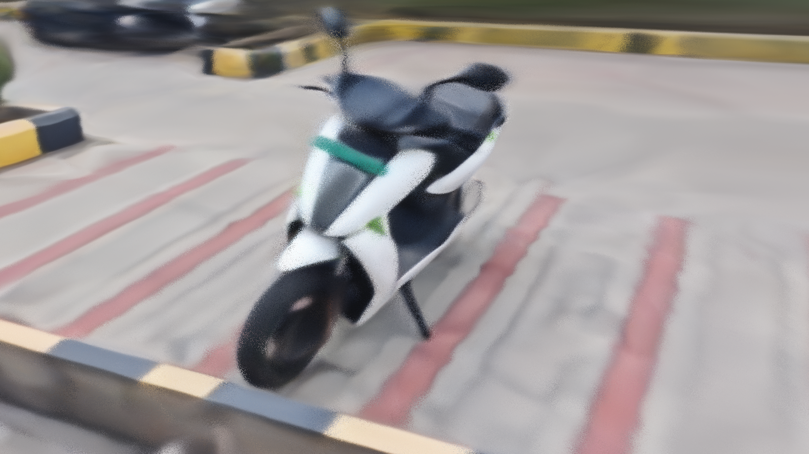
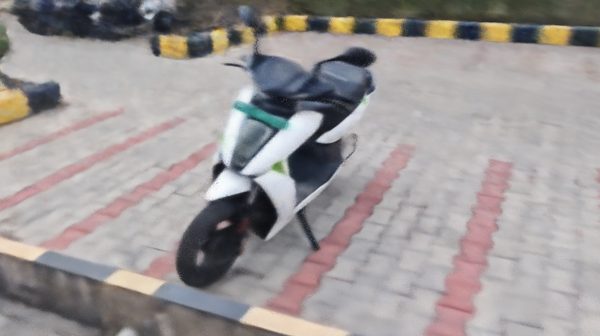
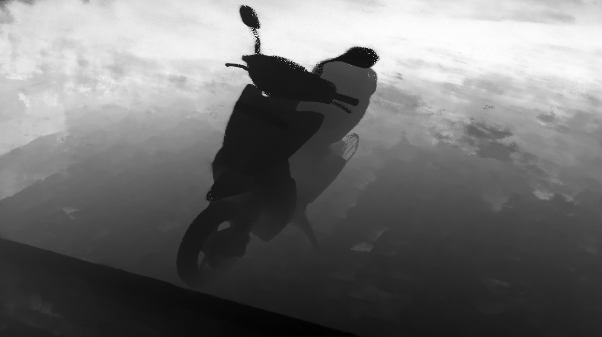
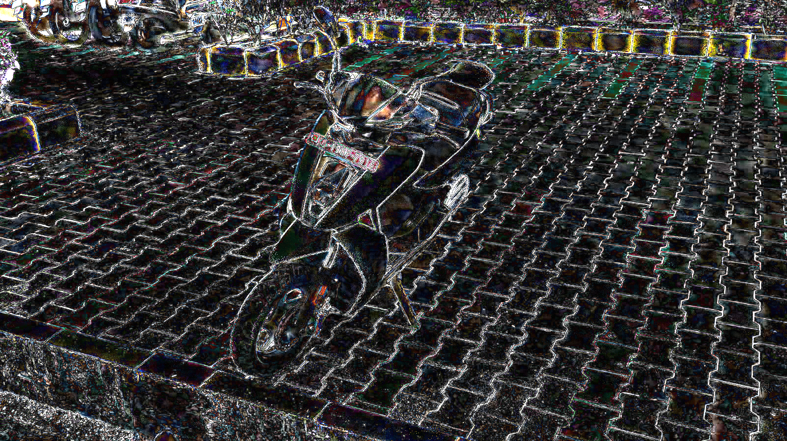
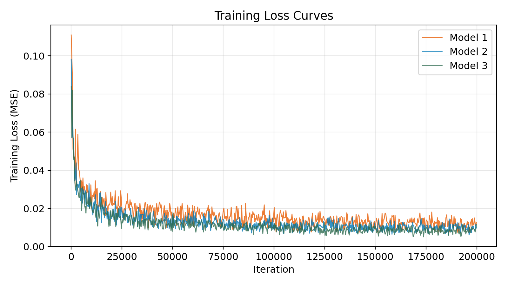
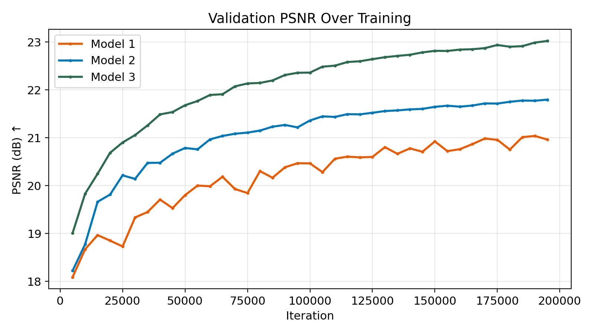
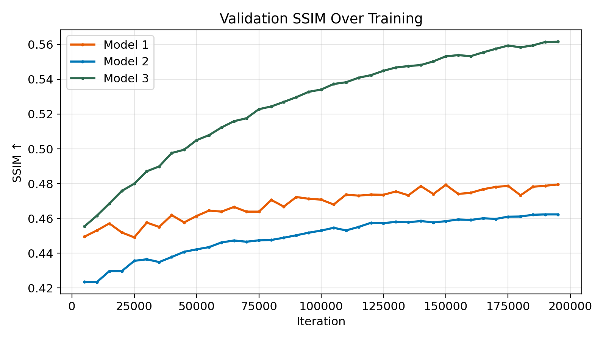
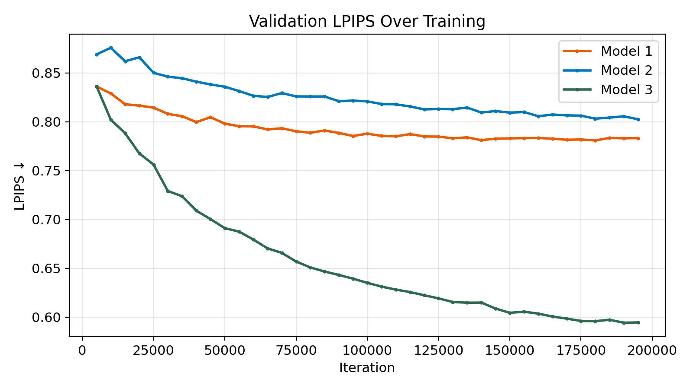

<h1 align="center">NeRF — From-Scratch Implementation & Ablation Study</h1>

<p align="center">
  <em>A clean, ~700-line PyTorch implementation of <a href="https://arxiv.org/abs/2003.08934">Neural Radiance Fields</a> with a systematic ablation study on positional encoding and hierarchical sampling.</em>
</p>

<p align="center">
  
</p>

<p align="center">
  <strong>▶ Spiral Render — Novel View Synthesis (Model 3)</strong>
</p>

<p align="center">
  <a href="media/spiral_render.mp4">
    
  </a>
</p>

<p align="center">
  <em>Click the image above to download the spiral flythrough video, or <a href="media/spiral_render.mp4">download directly</a>.</em>
</p>

---

## Table of Contents

- [Overview](#overview)
- [Features](#features)
- [Project Structure](#project-structure)
- [Results](#results)
  - [Ablation Study](#ablation-study)
  - [Qualitative Comparison](#qualitative-comparison)
  - [Depth & Error Maps](#depth--error-maps)
  - [Training Curves](#training-curves)
  - [Spiral Render Video](#spiral-render-video)
- [Getting Started](#getting-started)
  - [Prerequisites](#prerequisites)
  - [Installation](#installation)
- [Preparing Your Own Data](#preparing-your-own-data)
  - [Step 1 — Extract & Scale Frames from Video (FFmpeg)](#step-1--extract--scale-frames-from-video-ffmpeg)
  - [Step 2 — Run COLMAP Reconstruction](#step-2--run-colmap-reconstruction)
  - [Step 3 — Undistort Images (Simple Radial → Pinhole)](#step-3--undistort-images-simple-radial--pinhole)
  - [Step 4 — Convert Binary to Text](#step-4--convert-binary-to-text)
  - [Final Directory Structure](#final-directory-structure)
- [Training](#training)
- [Rendering a Spiral Video](#rendering-a-spiral-video)
- [Configuration Reference](#configuration-reference)
- [Architecture](#architecture)
- [Citation](#citation)

---

## Overview

This is a from-scratch implementation of [NeRF (Mildenhall et al., ECCV 2020)](https://arxiv.org/abs/2003.08934) covering the complete pipeline:

1. **Ray generation** from camera intrinsics & extrinsics (pinhole model)
2. **Stratified sampling** with jittered bins along each ray
3. **Hierarchical sampling** via inverse CDF transform from coarse network weights
4. **Positional encoding** — sinusoidal lifting to combat spectral bias
5. **8-layer MLP** with skip connection, density/color heads
6. **Differentiable volume rendering** with alpha compositing

The implementation supports both **Blender synthetic** datasets and **COLMAP real-world** scenes, with adaptive per-image near/far bounds computed from the sparse 3D point cloud.

## Features

- **~700 lines of Python** — minimal, readable, no external NeRF frameworks
- **Two dataset loaders** — Blender (JSON transforms) and COLMAP (cameras/images/points3D text files)
- **Coarse + Fine network** training with joint MSE loss
- **Comprehensive metrics** — PSNR, SSIM, LPIPS (AlexNet), weight entropy, fine concentration
- **Validation artifacts** — rendered RGB, depth maps, 5× amplified error maps saved every N iterations
- **Spiral video generation** — automated novel-view spiral camera path with FFmpeg encoding
- **Precomputed ray batching** — flatten all rays into a single tensor for O(1) random access
- **Checkpoint resume** — save/load optimizer, scheduler, and model state

## Project Structure

```
NeRF/
├── model.py            # 8-layer MLP with skip connection (Net)
├── render.py           # Ray generation, stratified/hierarchical sampling, volume rendering
├── dataset.py          # BlenderDataset and ColmapDataset loaders
├── train.py            # Training loop with validation and checkpointing
├── metrics.py          # PSNR, SSIM, LPIPS, entropy, CSV logging
├── spiral_video.py     # Generate spiral camera path and render video
├── configs/
│   ├── blender.yaml    # Config for Blender synthetic (e.g. Lego)
│   ├── colmap.yaml     # Config for COLMAP real-world scene
│   ├── model1.yaml     # Ablation: no PE, stratified only
│   ├── model2.yaml     # Ablation: + positional encoding
│   └── model3.yaml     # Ablation: + PE + hierarchical sampling
└── media/              # Images for this README
```

---

## Results

### Ablation Study

We trained three model configurations on a real-world scene (captured with a phone camera, reconstructed via COLMAP) to isolate the contributions of **positional encoding** and **hierarchical sampling**. All models share the same 8-layer MLP, optimizer (Adam, lr=5e-4), and training schedule (200K iterations, batch size 1024).

| Model | Positional Encoding | Hierarchical Sampling | N_c | N_f | PSNR ↑ | SSIM ↑ | LPIPS ↓ | Weight Entropy | Fine Conc. |
|:------|:-------------------:|:---------------------:|:---:|:---:|:------:|:------:|:-------:|:--------------:|:----------:|
| **Model 1** (Baseline) | ✗ | ✗ | 64 | 0 | 20.96 dB | 0.4795 | 0.7833 | 1.49 | — |
| **Model 2** (+ PE) | ✓ | ✗ | 64 | 0 | 21.80 dB | 0.4623 | 0.8026 | 1.59 | — |
| **Model 3** (+ PE + Hier.) | ✓ | ✓ | 64 | 128 | **23.02 dB** | **0.5616** | **0.5946** | 2.54 | 0.1129 |

#### Key Findings

- **Positional encoding (Model 1 → 2):** +0.84 dB PSNR improvement. Without sinusoidal lifting, the MLP can only represent low-frequency content — producing uniformly blurry reconstructions regardless of training duration. The slight SSIM drop is expected: as the model begins resolving high-frequency textures, minor misalignments can reduce local structural coherence.

- **Hierarchical sampling (Model 2 → 3):** +1.22 dB PSNR, +0.10 SSIM, and a dramatic 0.21 LPIPS reduction. By concentrating fine samples near surfaces detected by the coarse network, the fine network receives far more samples where they matter most. The fine concentration metric (0.113) confirms that ~11.3% of fine samples land within ±0.1 of the coarse expected depth.

### Qualitative Comparison

<table>
  <tr>
    <td align="center"><strong>Model 1</strong><br/><em>No PE, Stratified Only</em></td>
    <td align="center"><strong>Model 2</strong><br/><em>+ Positional Encoding</em></td>
    <td align="center"><strong>Model 3</strong><br/><em>+ PE + Hierarchical</em></td>
  </tr>
  <tr>
    <td></td>
    <td></td>
    <td></td>
  </tr>
</table>

Model 1 produces a blurry, low-contrast image lacking fine detail. Model 2 resolves textures and edges but exhibits geometric artifacts. Model 3 produces the sharpest reconstruction with well-defined geometry and minimal artifacts.

### Depth & Error Maps

<table>
  <tr>
    <td align="center"><strong>Depth Map</strong> (Model 3)</td>
    <td align="center"><strong>Error Map</strong> (5× amplified, Model 3)</td>
  </tr>
  <tr>
    <td></td>
    <td></td>
  </tr>
</table>

### Training Curves

<table>
  <tr>
    <td align="center"><strong>Training Loss</strong></td>
    <td align="center"><strong>PSNR</strong></td>
  </tr>
  <tr>
    <td></td>
    <td></td>
  </tr>
  <tr>
    <td align="center"><strong>SSIM</strong></td>
    <td align="center"><strong>LPIPS</strong></td>
  </tr>
  <tr>
    <td></td>
    <td></td>
  </tr>
</table>

All models converge within ~50K iterations. Model 3 achieves the lowest final training loss. The PSNR gap between models widens during training, indicating that the benefits of PE and hierarchical sampling compound with longer optimization.

### Spiral Render Video

A 120-frame spiral flythrough rendered from Model 3 (PE + hierarchical sampling):

<p align="center">
  <a href="media/spiral_render.mp4">
    
  </a>
</p>

<p align="center"><em>Click to download the spiral flythrough video.</em></p>

---

## Getting Started

### Prerequisites

- Python 3.8+
- PyTorch (with CUDA for GPU training)
- FFmpeg (for frame extraction and video generation)
- COLMAP (for real-world scene reconstruction)

### Installation

```bash
git clone https://github.com/<your-username>/NeRF.git
cd NeRF

pip install torch torchvision
pip install numpy pillow pyyaml tqdm scikit-image lpips matplotlib pandas
```

---

## Preparing Your Own Data

This section walks through the full pipeline to go from a **phone video** to a **trained NeRF**, using FFmpeg for frame extraction, COLMAP for camera pose estimation, and the undistortion step required for simple radial cameras.

### Step 1 — Extract & Scale Frames from Video (FFmpeg)

Extract frames from your video and downscale them (recommended: 1080→540 or similar to keep training manageable):

```bash
# Create output directory
mkdir -p data/my_scene/images_raw

# Extract every 10th frame and scale to 540p width (preserving aspect ratio)
ffmpeg -i my_video.mp4 \
  -vf "select=not(mod(n\,10)),scale=540:-2" \
  -vsync vfr \
  -q:v 2 \
  data/my_scene/images_raw/%04d.jpg
```

**Tips:**
- `-vf "select=not(mod(n\,10))"` — take every 10th frame. Adjust based on video framerate and motion; you want ~50–150 images with good coverage and minimal blur.
- `scale=540:-2` — scale width to 540px, height auto (divisible by 2). Use `scale=960:-2` for higher quality at the cost of more memory/time.
- `-q:v 2` — JPEG quality (1=best, 31=worst). Keep at 2 for minimal compression artifacts.

### Step 2 — Run COLMAP Reconstruction

COLMAP performs Structure-from-Motion (SfM) to estimate camera poses and a sparse 3D point cloud.

```bash
# Create workspace directories
mkdir -p data/my_scene/sparse
mkdir -p data/my_scene/database

# 1. Feature extraction
colmap feature_extractor \
  --database_path data/my_scene/database/database.db \
  --image_path data/my_scene/images_raw \
  --ImageReader.single_camera 1 \
  --ImageReader.camera_model SIMPLE_RADIAL

# 2. Feature matching
colmap exhaustive_matcher \
  --database_path data/my_scene/database/database.db

# 3. Sparse reconstruction (auto mapper with shared intrinsics)
colmap mapper \
  --database_path data/my_scene/database/database.db \
  --image_path data/my_scene/images_raw \
  --output_path data/my_scene/sparse
```

> **Note:** `--ImageReader.single_camera 1` tells COLMAP to use **shared intrinsics** across all images (since they come from the same phone camera). This is critical for consistent reconstruction.

After this, your sparse reconstruction will be in `data/my_scene/sparse/0/` as binary files (`cameras.bin`, `images.bin`, `points3D.bin`).

### Step 3 — Undistort Images (Simple Radial → Pinhole)

Phone cameras typically show as `SIMPLE_RADIAL` in COLMAP (focal length + one radial distortion parameter). NeRF assumes a **pinhole camera** (no distortion), so we need to undistort:

```bash
colmap image_undistorter \
  --image_path data/my_scene/images_raw \
  --input_path data/my_scene/sparse/0 \
  --output_path data/my_scene/undistorted \
  --output_type COLMAP
```

This will:
- Undistort all images and save them to `data/my_scene/undistorted/images/`
- Create a new sparse model with **PINHOLE** camera parameters in `data/my_scene/undistorted/sparse/`

### Step 4 — Convert Binary to Text

Our dataset loader reads COLMAP's **text** format. Convert the binary files:

```bash
mkdir -p data/my_scene/undistorted/sparse_txt

colmap model_converter \
  --input_path data/my_scene/undistorted/sparse \
  --output_path data/my_scene/undistorted/sparse_txt \
  --output_type TXT
```

This produces the three text files our code expects:
- `cameras.txt` — camera intrinsics (PINHOLE: fx, fy, cx, cy)
- `images.txt` — per-image quaternion rotations and translations
- `points3D.txt` — sparse 3D point cloud

### Final Directory Structure

After all steps, your data directory should look like:

```
data/my_scene/undistorted/
├── images/
│   ├── 0001.jpg
│   ├── 0002.jpg
│   └── ...
└── sparse_txt/
    ├── cameras.txt
    ├── images.txt
    └── points3D.txt
```

---

## Training

1. **Create a config file** (or modify an existing one):

```yaml
# configs/my_scene.yaml
model_name: my_scene

data_dir: data/my_scene/undistorted    # path to your undistorted data
save_dir: output/my_scene              # where to save checkpoints, metrics, renders

dataset_type: Colmap
precompute_rays: true                  # flatten all rays for fast batching

L_pos: 10                             # positional encoding frequencies (position)
L_dir: 4                              # positional encoding frequencies (direction)

N_c: 64                               # coarse samples per ray
N_f: 128                              # fine samples per ray (0 = no hierarchical)

use_hierarchical: true
hierarchical: true

device: cuda
lr: 5.0e-4
N_iters: 200000
batch_size: 1024

val_every: 5000
ckpt_every: 10000

# resume_ckpt: output/my_scene/ckpts/ckpt_100000.pth   # uncomment to resume
```

2. **Run training:**

```bash
python train.py --config configs/my_scene.yaml
```

Training logs (PSNR, SSIM, LPIPS, loss, gradient norms) are saved to `output/my_scene/metrics.csv`. Validation renders, depth maps, and error maps are saved every `val_every` iterations.

## Rendering a Spiral Video

After training, generate a spiral flythrough video:

```bash
python spiral_video.py \
  --config configs/my_scene.yaml \
  --ckpt output/my_scene/ckpts/ckpt_200000.pth \
  --out output/my_scene/spiral \
  --frames 120 \
  --revolutions 2 \
  --fps 30
```

This renders frames along an inward-spiraling camera path and stitches them into an MP4 using FFmpeg.

---

## Configuration Reference

| Parameter | Description | Default |
|:----------|:------------|:--------|
| `dataset_type` | `Blender` or `Colmap` | — |
| `data_dir` | Path to dataset root | — |
| `save_dir` | Output directory for checkpoints/metrics/renders | — |
| `device` | `cuda` or `cpu` | `cuda` |
| `precompute_rays` | Precompute & cache all rays in memory | `true` |
| `L_pos` | Positional encoding frequencies for position (0 = disabled) | `10` |
| `L_dir` | Positional encoding frequencies for direction (0 = disabled) | `4` |
| `N_c` | Number of coarse samples per ray | `64` |
| `N_f` | Number of fine samples per ray (0 = no hierarchical) | `128` |
| `use_hierarchical` | Enable hierarchical sampling | `true` |
| `batch_size` | Number of rays per training iteration | `1024` |
| `N_iters` | Total training iterations | `200000` |
| `lr` | Initial learning rate (Adam) | `5e-4` |
| `val_every` | Validation frequency (iterations) | `5000` |
| `ckpt_every` | Checkpoint save frequency (iterations) | `10000` |
| `t_near` / `t_far` | Fixed near/far bounds (Blender only) | `2.0` / `6.0` |
| `resume_ckpt` | Path to checkpoint for resuming training | `null` |

---

## Architecture

```
Input: γ(x) ∈ ℝ^63  (position, L=10)
       γ(d) ∈ ℝ^27  (direction, L=4)

       γ(x)
        │
   ┌────▼────┐
   │ Linear  │ 63 → 256
   │  ReLU   │
   ├─────────┤
   │ Linear  │ 256 → 256    ×3 layers
   │  ReLU   │
   ├─────────┤
   │  Skip   │ concat γ(x): 256+63 → 256
   │  ReLU   │
   ├─────────┤
   │ Linear  │ 256 → 256    ×3 layers
   │  ReLU   │
   ├────┬────┤
   │    │    │
   │    ▼    ▼
   │  σ head  Feature
   │ Softplus  256-d
   │    │       │
   │    │   concat γ(d): 256+27
   │    │       │
   │    │   ┌───▼───┐
   │    │   │Linear │ 283 → 256, ReLU
   │    │   │Linear │ 256 → 3, Sigmoid
   │    │   └───┬───┘
   │    │       │
   │    σ      RGB
```

---

## Citation

If you find this implementation useful, please cite the original NeRF paper:

```bibtex
@inproceedings{mildenhall2020nerf,
  title     = {NeRF: Representing Scenes as Neural Radiance Fields for View Synthesis},
  author    = {Mildenhall, Ben and Srinivasan, Pratul P. and Tancik, Matthew and
               Barron, Jonathan T. and Ramamoorthi, Ravi and Ng, Ren},
  booktitle = {European Conference on Computer Vision (ECCV)},
  year      = {2020}
}
```
